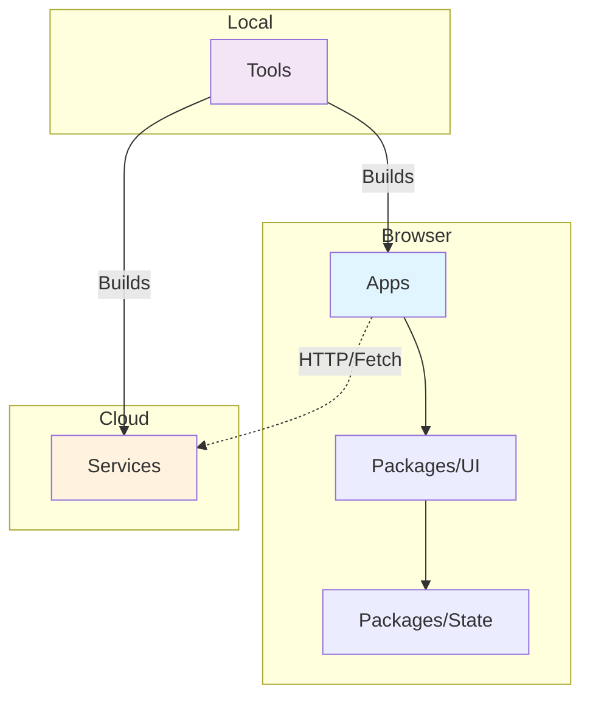

# Ticket: Enforce Monorepo Architecture via Tooling

**Status:** Proposed / Future
**Priority:** High (Foundational for AI & Student Compliance)

## Objective
Replace passive documentation with active tooling to enforce architectural boundaries between Apps, Packages, Services, and Tools. This shift from "Architecture as Text" to "Architecture as Code" is necessary because both AI agents and junior developers struggle to strictly follow written architectural guides.

## Action Items

### 1. The "Electric Fence": Implement Dependency Cruiser
Install and configure `dependency-cruiser` to strictly forbid architectural violations at build time.

**Proposed Config (`tools/dep-cruiser-config.js`):**
- **Rule 1: No Backend in UI**
  - *From:* `packages/ui-lit` (or any client-side package)
  - *To:* `services/*`, `fs`, `path`, `os` (Node.js built-ins)
  - *Error:* "UI components cannot import Services or Node.js built-ins."
- **Rule 2: No Tools in Production**
  - *From:* `apps/*`, `packages/*`, `services/*`
  - *To:* `tools/*`
  - *Error:* "Production code cannot depend on build tools."

### 2. The "Paved Road": Scaffolding Scripts
Create interactive scripts to automate the creation of new workspace members, removing the decision of "where does this file go?"

**Command:** `pnpm create:service <name>`
- **Behavior:**
  1. Creates folder in `services/<name>` (NOT `packages/` or `tools/`).
  2. Copies "Golden Master" `tsconfig.json` and `package.json`.
  3. Registers the service in the workspace.

### 3. The "Visual Map": Architecture Diagrams
Add a Mermaid diagram to the root `README.md` to provide an instant visual reference of the dependency flow.

---

## Context & Background Discussion

### The Problem
The repository has clear documentation (`guides/FUNCTIONS_PLACEMENT.md`, `guides/STANDARDS_STYLES.md`), but compliance is low.
1.  **AI Agents:** Often ignore file placement rules or hallucinate imports (e.g., importing server code into UI components).
2.  **Junior Developers/Students:** Find the distinction between "Services" and "Tools" or "Packages" confusing, leading to misplaced code.

### Architectural Definitions (Clarified)
The following mental model was established to rationalize the workspace structure:

| Workspace | Runtime | Purpose | Definition |
| :--- | :--- | :--- | :--- |
| **Apps** (`apps/`) | Browser | **The Product** | Web deployed chunks of functionality. The entry point for users. |
| **Packages** (`packages/`) | Browser/Shared | **The Building Blocks** | Shared libraries (UI, State, Types). Cannot run alone. |
| **Services** (`services/`) | Server (Node/Cloud) | **The Backend** | Code that runs on a separate server (Cloud Functions, API). Has privileged access. Can be polyglot (Node, Python, Go). |
| **Tools** (`tools/`) | Local Node.js | **The Maintenance** | Meta-code. Scripts for building, linting, and deploying. Never deployed to users. |
| **Extensions** (`extensions/`) | VS Code | **The IDE Plugin** | Code that runs inside the editor. |

### Key Insights
- **Services vs. Tools:**
  - *Confusion:* "Is a script a tool or a service?"
  - *Clarification:* If it runs on your laptop to build the app, it's a **Tool**. If it runs on AWS/Google Cloud to serve data to the app, it's a **Service**.
- **Polyglot Services:**
  - The `services/` folder is the designated home for non-TypeScript backends (Python, Rust, etc.) in the future. Apps don't care about the language, only the API contract.
- **Why Docs Failed:**
  - Docs are passive. AIs and humans take the path of least resistance.
  - **Solution:** Tooling provides immediate feedback (red squigglies, build failures) which forces compliance without requiring the user to memorize the `guides/` folder.
