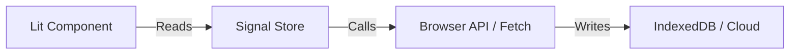
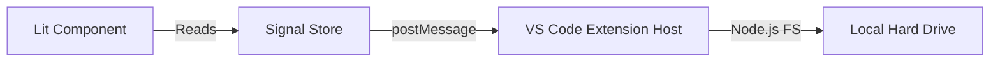

# How To Build Apps as VSCode Extension

## Overview
This document outlines the strategy for migrating existing Lit/Signal-based web applications into a VS Code Extension architecture. This approach allows for "Backend-for-Frontend" capabilities using the VS Code Extension Host (Node.js) while preserving the existing UI/State logic.

## Architecture Shift

The core shift is replacing the "Data Layer" while keeping the "Presentation Layer" intact.

### 1. Browser Architecture (Current)


### 2. VS Code Extension Architecture (Target)


## Key Advantages
1.  **Native File System Access:** No `FileSystemHandle` or permission prompts. The Extension Host has full Node.js `fs` access.
2.  **No CORS:** The Extension Host is a server-side environment. It can call any API (OpenAI, Firebase, etc.) without browser security restrictions.
3.  **Secure Secrets:** API keys can be stored in the OS Keychain via `context.secrets` instead of exposed in frontend code.
4.  **Reuse:** `packages/ui-lit`, `packages/state`, and `packages/types` are 100% reusable.

## Implementation Strategy

### 1. Monorepo Structure
The existing pnpm + Turbo structure is ideal.
```text
apps/
  df-vscode-extension/   <-- The "Host" (Node.js)
    package.json         <-- Defines the extension
    src/
      extension.ts       <-- The backend logic
  df-extension-ui/       <-- The "Client" (Lit App)
    package.json
    src/                 <-- Your UI components
    vite.config.ts       <-- Builds the UI bundle
```

### 2. The "Bridge" Pattern
Replace direct `fetch` calls in stores with a message-passing bridge.

**Client (Webview):**
```typescript
// packages/vscode-bridge/src/client.ts
const vscode = acquireVsCodeApi();

export function sendToExtension(command: string, data: any) {
  vscode.postMessage({ command, data });
}

// Listen for responses
export const extensionMessages = new EventTarget();
window.addEventListener('message', event => {
  const message = event.data;
  extensionMessages.dispatchEvent(new CustomEvent(message.command, { detail: message.data }));
});
```

**Store (Signal-based):**
```typescript
// packages/state/src/stores/file-store.ts
import { signal } from '@lit-labs/signals';
import { sendToExtension, extensionMessages } from '@df/vscode-bridge';

export const fileContent = signal('');

export function loadFile(path: string) {
  sendToExtension('readFile', { path });
}

extensionMessages.addEventListener('fileReadSuccess', (e: any) => {
  fileContent.set(e.detail.content);
});
```

**Host (Extension):**
```typescript
// src/extension.ts
import * as vscode from 'vscode';
import * as fs from 'fs';

export function activate(context: vscode.ExtensionContext) {
  context.subscriptions.push(
    vscode.commands.registerCommand('df.openApp', () => {
      const panel = vscode.window.createWebviewPanel('dfApp', 'DF App', vscode.ViewColumn.One, {
        enableScripts: true
      });

      panel.webview.onDidReceiveMessage(async message => {
        switch (message.command) {
          case 'readFile':
            const content = fs.readFileSync(message.data.path, 'utf8');
            panel.webview.postMessage({ command: 'fileReadSuccess', data: { content } });
            break;
        }
      });
    })
  );
}
```

## Authentication (Firebase)
Since the Extension Host is Node.js, standard browser flows (`signInWithPopup`) don't work directly.

**Recommended Approach (Personal Use):**
1.  **Service Account:** Use `firebase-admin` SDK with a service account key stored locally. Grants full admin access.
2.  **VS Code Auth:** Use `vscode.authentication.getSession('google')` to get a token, then exchange it for a Firebase credential.

## UI Integration Patterns
*   **Side-by-Side Panel:** Register a command in `package.json` menus (`editor/title`) to open the Webview alongside the active editor (like Markdown Preview).
*   **Context Awareness:** The extension can detect the active file (`.md`, `.yaml`) and pass that context to the Webview to render the appropriate tools.
*   **One Extension:** A single extension can handle multiple file types and tools by checking `resourceLangId`.

## Webview Placement Options

VS Code offers three main locations for Webviews, each serving a different purpose.

### 1. Editor Area (The "Main Stage")
*   **What it is:** A tab in the main editor group (like a file).
*   **Best for:** Heavy tasks, full-screen dashboards, or "Custom Editors" (e.g., a visual Markdown editor).
*   **Trigger:** Command Palette, File Open, or "Open to the Side" button.

### 2. Primary Side Bar (The "Explorer" Area)
*   **What it is:** A view in the left-hand sidebar (alongside Explorer, Search, Git).
*   **Best for:** Navigation, file trees, or tools that need to be always visible while editing.
*   **Implementation:** Register a `WebviewViewProvider` in `package.json` under `contributes.views`.
    ```json
    "contributes": {
      "viewsContainers": {
        "activitybar": [
          {
            "id": "df-tools",
            "title": "DF Tools",
            "icon": "resources/icon.svg"
          }
        ]
      },
      "views": {
        "df-tools": [
          {
            "id": "df.toolsView",
            "name": "Writer Tools",
            "type": "webview"
          }
        ]
      }
    }
    ```

### 3. Secondary Side Bar (The "Panel" Area)
*   **What it is:** The panel on the right (usually) or bottom (Terminal area).
*   **Best for:** Auxiliary tools, chat interfaces (like Copilot), or context-aware helpers.
*   **Implementation:** Same as Primary Side Bar, but you can drag the view there, or specify `panel` location.

### Adding Buttons to Access Webviews
You can add buttons (icons) to various locations to trigger your Webview or Command.

*   **Editor Title Bar (Top Right of File):**
    *   Best for "Open Preview" style actions.
    *   Config: `menus` -> `editor/title`.
*   **Activity Bar (Far Left Strip):**
    *   Best for opening your Primary Side Bar view.
    *   Config: `viewsContainers` -> `activitybar`.
*   **Status Bar (Bottom Blue Strip):**
    *   Best for global toggles or status indicators.
    *   Config: `createStatusBarItem` API.

## Build Workflow
1.  **Vite:** Bundles the UI app into `dist/webview/index.js`.
2.  **tsup/esbuild:** Bundles the Extension Host into `dist/extension.js`.
3.  **Watch Mode:** Run both in parallel for instant feedback (Hot Module Replacement for UI, Reload Window for Host).

## Folder Structure Decision

**Decision:** Create a new top-level `extensions/` directory (peer to `apps/`, `packages/`, `services/`).

**Rationale:**
1.  **Teaching Clarity:** Clearly distinguishes "Browser Apps" (`apps/`) from "VS Code Extensions" (`extensions/`).
2.  **Environment Separation:** Reinforces that extensions run in a different host environment (Node.js + Webview) compared to standard web apps.
3.  **Configuration Scoping:** Allows for specific TSConfig or build settings for extensions without polluting the web app configuration.

**Required Updates:**
*   Update `pnpm-workspace.yaml` to include `extensions/*`.
*   Update `turbo.json` to ensure pipeline coverage for the new folder.
