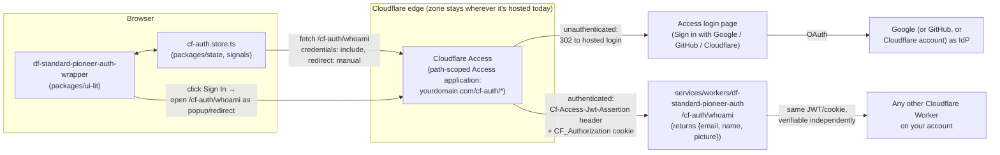

# Cloudflare Implementation based on df-auth-wrapper

**Status:** Planning / handoff spec — not yet implemented
**Target component name:** `df-standard-pioneer-auth-wrapper`
**Target platform:** Cloudflare (Workers + Zero Trust Access), replacing Firebase Authentication
**Lives in:** the dF monorepo, alongside `df-auth-wrapper` (see §2 — this was originally scoped for a separate repo; that framing is superseded)
**Source of truth (read-only reference, do not modify):**
- Component: [packages/ui-lit/src/df-auth-wrapper.ts](../../packages/ui-lit/src/df-auth-wrapper.ts)
- Usage example: [apps/df-storybook/stories/df-auth-wrapper.stories.ts](../../apps/df-storybook/stories/df-auth-wrapper.stories.ts)

---

## 0. How to use this document

This is a self-contained implementation spec for `df-standard-pioneer-auth-wrapper`, the Cloudflare-backed sibling of `df-auth-wrapper`. It assumes **zero prior Cloudflare experience** on the team, per the original brief — every Cloudflare-specific term is explained the first time it's used.

It also assumes the reader has this repo checked out and can read `guides/STANDARDS_STYLES.md` and `guides/WC_SHARED_DEFAULTS.md` directly — §3 gives a condensed, load-bearing summary of those rules so this document doesn't require a second window open, but those files remain the canonical source if the two ever disagree.

---

## 1. What this project is

`df-auth-wrapper` is a Lit web component that wraps arbitrary slotted HTML and shows it only after Google Sign-In, using Firebase Authentication as the backend. It is not a full security boundary by itself — it hides content client-side and stashes a bearer token for other code to use; real authorization still has to happen server-side. It works well for its purpose today.

The company is migrating off Firebase and onto Cloudflare wherever reasonable. This is the **first real Cloudflare product test**: build a sibling wrapper, `df-standard-pioneer-auth-wrapper`, backed by Cloudflare instead of Firebase, while changing as little else as possible.

### Guardrails from the brief (carried through this whole document)

1. **Don't let a Cloudflare/React-flavored ecosystem pull the codebase off Lit + Web Components + signals.** Everything Cloudflare-specific here is backend/infrastructure; the component itself stays a plain Lit element, built and shipped exactly the way every other `packages/ui-lit` component is.
2. **This is iteration 1.** Where a corner must be cut to ship something real, cut it deliberately and write it down (see §9, "Technical Debt Log") rather than silently doing the harder thing or silently doing the worse thing.
3. **Google Sign-In must keep working, unchanged in spirit** (any Google account, not just an org's Workspace). GitHub and/or "login with Cloudflare" are welcome *in addition*, not instead.
4. **The JWT question is open and this document answers it**: don't try to carry Firebase ID tokens into Cloudflare. Cloudflare Access mints its own JWT that is *specifically designed* to be verified by other Cloudflare Workers/apps on the same account — see §8. That is strictly more useful than what Firebase gave you for this purpose.
5. **Follow this repo's existing conventions**, not a green-field Cloudflare-idiomatic layout. §3 restates the load-bearing rules; §2 works out where the new pieces physically go.

---

## 2. Where this lives in the dF monorepo

This component was originally scoped as a handoff to a separate repository. On review, there's no reason for that: it has to follow this repo's Lit/signals/MD3 conventions regardless of what's behind it, so building it here means it inherits `pnpm scan:compliance`, Storybook, the Turbo build graph, and `@df/types`/`@df/ui-lit` sharing for free instead of duplicating that tooling elsewhere.

### 2.1 File layout

```
packages/
  types/src/
    cf-auth.types.ts          # CfUser, CfAuthState, CfAuthConfig — canonical types (§10)
  state/src/stores/
    cf-auth.store.ts          # signals-first store (§10)
  ui-lit/src/
    df-standard-pioneer-auth-wrapper.ts   # the component (§11)

apps/df-storybook/stories/
  df-standard-pioneer-auth-wrapper.stories.ts   # mirrors df-auth-wrapper.stories.ts

services/workers/                      # NEW — see §2.2
  df-standard-pioneer-auth/
    src/worker.ts
    wrangler.jsonc
    package.json
```

This is the same shape as `df-auth-wrapper`'s own split (component in `ui-lit`, signals in `state`, shared types in `types`) — the only genuinely new thing is `services/workers/`, because there's no Cloudflare Worker anywhere in this repo yet.

### 2.2 A new convention: Cloudflare Workers placement (proposed)

`guides/FUNCTIONS_PLACEMENT.md` currently says all backend code goes in `services/functions/` or `services/auth-functions/` — but that rule (and its ESM/`NodeNext` configuration requirements) is written specifically for **Firebase Cloud Functions**. A Cloudflare Worker is a different kind of backend: it's deployed with `wrangler`, not `firebase deploy`, and it doesn't have Firebase's auth-triggered-function event model. It doesn't cleanly fit `packages/` (browser libraries bundled for consumption by apps) or `services/functions/` (Firebase-shaped) either.

**Proposal:** a new `services/workers/` directory, one pnpm workspace per Worker, same pattern as `services/functions/` but for Cloudflare. This document uses that path throughout. **Confirm this with whoever owns `guides/` before treating it as settled** — it's the natural extension of the existing Firebase/non-Firebase split, but it hasn't been formally adopted yet. If it's approved, the follow-up is a short `guides/WORKERS_PLACEMENT.md` sibling to `guides/FUNCTIONS_PLACEMENT.md`; that file is out of scope here.

### 2.3 Config & secrets: Workers vs. the rest of the repo

Every other app in this repo configures Firebase via `.env` files and `VITE_USE_EMULATOR`, read through `import.meta.env.VITE_*` at build time (Vite). **None of that exists inside a Cloudflare Worker** — Workers run in a different JS runtime with no `import.meta.env`. Worker configuration instead uses:
- `wrangler.jsonc`'s `vars` block for non-secret config (§7.1)
- `wrangler secret put NAME` for anything sensitive — encrypted, not visible in the dashboard or config file after it's set
- `.dev.vars` (git-ignored) for local secret values when running `wrangler dev`

No conflict with the existing pattern — just don't reach for the Firebase-app config helpers (`loadFirebaseConfig()`, `shouldUseEmulatorForService()`, etc.) inside `services/workers/*`; they don't apply there and won't resolve.

### 2.4 CI / deploy

Current CI presumably only knows `firebase deploy` (Hosting, Functions, Firestore rules). Shipping this Worker needs a `wrangler deploy` step added wherever that pipeline lives, scoped to `services/workers/df-standard-pioneer-auth/`. Not addressed further here — flagged so it isn't a surprise at ship time.

---

## 3. Conventions this component must follow (from `guides/STANDARDS_STYLES.md` and `guides/WC_SHARED_DEFAULTS.md`)

- **Lit + TypeScript.** Author in TypeScript, compile to JS via the package's normal build step.
- **Signals-first, presentation-only components.** The component never owns persisted state or talks to the network directly for business data — it reads signals from a small store module and calls exported functions on that store. All the actual session/auth logic lives in `cf-auth.store.ts`, not in the component.
- **`SignalWatcher(LitElement)`.** Any component that reads signals in `render()` extends `SignalWatcher` from `@lit-labs/signals` so it re-renders automatically when a signal changes.
- **Property declaration pattern.** Use `declare` with `@property`/`@state` and initialize real values in the constructor — never as a class-field default — to avoid Lit's property-shadowing footgun.
  ```typescript
  @property({type: Boolean}) declare headless: boolean;
  constructor() {
    super();
    this.headless = false;
  }
  ```
- **Material Design 3 components only.** No native `<button>`, `<input>`, `<select>`. Use `@material/web` elements (`<md-filled-button>`, `<md-text-button>`, `<md-circular-progress>`, etc.). Where Material Web has no shipped component but a MD3 spec exists, implement the spec manually, keep native accessibility semantics, and log the gap per `guides/STANDARDS_STYLES.md`'s MD3 Gaps process — this component doesn't need any such gap-filling, but the rule applies if that changes.
- **MD3 registration stays centralized.** Do not add a per-component `material-design-init.ts` or import `@material/web/*` anywhere except through `packages/ui-lit/src/material-design-init.ts`. If this component needs an MD3 element not already registered there, add the import to that file, not to `df-standard-pioneer-auth-wrapper.ts` (see `guides/MATERIAL_DESIGN_INITIALIZATION.md`).
- **Event naming: `[component-name]-[action]`.** The original component fires `df-auth-wrapper-user-changed`. This one fires `df-standard-pioneer-auth-wrapper-user-changed`, same `{detail: {newValue: User | null}}` shape.
- **CSS custom properties with fallbacks at the point of use**, not at the point of definition (avoids circular var references).
- **Canonical types live in `@df/types`.** `CfUser`, `CfAuthState`, `CfAuthConfig` are defined once in `packages/types/src/cf-auth.types.ts` and imported by both the store and the Worker — not hand-copied into each.
- **No commented-out code, no console.log left behind, no partial features.** Small, complete, reviewable increments.

Nothing here is Cloudflare-specific — these rules hold regardless of what's behind the wrapper, which is why they carry over unchanged.

---

## 4. Concept mapping: Firebase → Cloudflare

| Firebase concept | Cloudflare equivalent |
|---|---|
| Firebase Authentication (Google provider) | **Cloudflare Access** (part of Cloudflare Zero Trust) configured with Google as an identity provider |
| Firebase ID token (JWT), `sessionStorage.Authorization` | **Access JWT**, delivered as the `Cf-Access-Jwt-Assertion` request header and the `CF_Authorization` cookie — managed by Cloudflare, not by your code |
| `initializeAuth(app)` | `initializeCfAuth()` — no SDK "app" object; just tells the store which endpoints to call |
| `signInWithGoogle()` (popup) | Navigating (full page or popup) to an Access-protected URL; Access itself shows the "Sign in with Google" screen |
| `signOut()` | Navigating/fetching `https://<your-domain>/cdn-cgi/access/logout` |
| `firebaseAuthState` signal | `cfAuthState` signal (new store, same shape: `authUser`, `authState`, `error`, `initialized`) |
| Firebase Auth Emulator + `emailPw` dev panel | `wrangler dev`'s `access.dev` local-identity stub. **No email/password concept exists on the Cloudflare side** — the dev panel is dropped, not ported (see §9). |
| Firebase Functions `functions.auth.user()` trigger | **No equivalent.** Workers have no "new user created" event. Any such logic has to be written explicitly inside the session Worker (see §9). |
| `localStorage.getItem('User')` / manual token mirroring | Not needed. Access already manages its own `httpOnly` cookie; the component only caches the *non-sensitive* profile fields it reads back from your session endpoint. |

---

## 5. Architecture



**Key architectural decision:** Cloudflare Access applications are scoped by **URL path**, not by whole domain. That is what lets this component behave the way `df-auth-wrapper` did — protecting *part* of an otherwise-public page — instead of gating an entire site behind a login wall. The Access application only covers `yourdomain.com/cf-auth/*`. Everything else — including the existing 11ty-built pages this repo's apps produce, wherever they're actually hosted today — stays exactly as it is; a Cloudflare **Route** attaches the Worker to that one path pattern on a zone whose DNS is proxied through Cloudflare, without requiring the whole site to move onto Cloudflare hosting. This Worker does **not** serve your static site — see §7.

---

## 6. One-time Cloudflare setup (do this before writing any code)

You'll do this in the Cloudflare dashboard, under **Zero Trust**. This is a one-time, per-project setup, analogous to enabling Google Sign-In in the Firebase console.

1. **Confirm your Zero Trust team domain.** Every Cloudflare account gets one, of the form `<your-team-name>.cloudflareaccess.com`, under **Zero Trust → Settings → Custom Pages / Team name**. Write it down — you'll need it as `TEAM_DOMAIN`.

2. **Add Google as an identity provider.** Zero Trust → **Settings → Authentication → Login methods → Add new**.
   - If your account offers a first-class **Google** connector, use it — it only asks for a Google Cloud OAuth **Client ID** and **Client Secret**.
   - If it doesn't (or you'd rather be explicit), use the **Generic OIDC** connector with Google's own endpoints:
     - Auth URL: `https://accounts.google.com/o/oauth2/auth`
     - Token URL: `https://accounts.google.com/o/oauth2/token`
     - Certificate (JWKS) URL: `https://www.googleapis.com/oauth2/v3/certs`
     - Scopes: `openid email profile`
   - Either way, when your Google OAuth client asks for an **authorized redirect URI**, use:
     ```
     https://<your-team-name>.cloudflareaccess.com/cdn-cgi/access/callback
     ```
   - Click **Test** on the new login method to confirm it works before moving on.

3. **(Optional, per the brief) Add GitHub and/or "Login with Cloudflare" the same way** — Zero Trust ships built-in connectors for both. These are additive; Google stays the primary/default path.

4. **Create a self-hosted Access application scoped to a narrow path** — this is the step that preserves partial-page protection:
   - Zero Trust → **Access → Applications → Add an application → Self-hosted**.
   - Application domain: `yourdomain.com`, **Path**: `/cf-auth/*` (not the bare domain — the path is what keeps the rest of the site public).
   - Under **Identity providers**, enable Google (and GitHub/Cloudflare if added).
   - Add a policy: **Action: Allow**, **Include: Everyone** (any authenticated account — this matches "any Google account can sign in," the same behavior Firebase gave you). Tighten this later with an email-domain rule if you ever need to restrict it.
   - Save, and copy the application's **Audience (AUD) tag** from its Overview page — you'll need it as `POLICY_AUD`.

That's the entire Cloudflare-side configuration. Everything else below is code in this repo.

---

## 7. The Worker: `services/workers/df-standard-pioneer-auth`

This is the Cloudflare equivalent of Firebase's auth state listener — a small server-side route the component asks "am I signed in, and as whom?" It is a narrow, standalone auth microservice attached to one path (`/cf-auth/*`) on an existing zone — **it does not serve this repo's static apps**; those keep deploying exactly the way they do today (Rollup bundles into an external 11ty instance, or wherever they currently land). Keeping the Worker's job this small is deliberate for a first Cloudflare test: it has exactly one responsibility.

### 7.1 `services/workers/df-standard-pioneer-auth/wrangler.jsonc`

`wrangler` is Cloudflare's CLI/config tool for Workers — think of it as the Firebase CLI's equivalent, scoped to this one package.

```jsonc
{
  "name": "df-standard-pioneer-auth",
  "main": "./src/worker.ts",
  "compatibility_date": "2026-08-28",
  "routes": [
    {"pattern": "yourdomain.com/cf-auth/*", "zone_name": "yourdomain.com"}
  ],
  "vars": {
    "TEAM_DOMAIN": "https://<your-team-name>.cloudflareaccess.com",
    "POLICY_AUD": "<the AUD tag from step 6.4>"
  }
}
```

`vars` here are plain, non-secret config — fine for a team domain and an audience tag, neither of which is sensitive. Never put anything actually secret (API keys, client secrets) in `vars`; use `wrangler secret put NAME` instead (§2.3).

### 7.2 `services/workers/df-standard-pioneer-auth/src/worker.ts`

```typescript
import {jwtVerify, createRemoteJWKSet} from 'jose';
import type {CfUser} from '@df/types';

interface Env {
  TEAM_DOMAIN: string;
  POLICY_AUD: string;
}

export default {
  async fetch(request: Request, env: Env): Promise<Response> {
    const url = new URL(request.url);

    if (url.pathname === '/cf-auth/whoami') {
      return handleWhoAmI(request, env);
    }

    return new Response('Not found', {status: 404});
  },
};

async function handleWhoAmI(request: Request, env: Env): Promise<Response> {
  // Defense-in-depth: this route only gets reached for requests that Access
  // already let through, but verify the JWT ourselves too rather than
  // trusting the edge blindly.
  const token = request.headers.get('Cf-Access-Jwt-Assertion');

  if (!token) {
    return new Response(JSON.stringify({error: 'not-authenticated'}), {
      status: 401,
      headers: {'Content-Type': 'application/json'},
    });
  }

  try {
    const JWKS = createRemoteJWKSet(new URL(`${env.TEAM_DOMAIN}/cdn-cgi/access/certs`));
    const {payload} = await jwtVerify(token, JWKS, {
      issuer: env.TEAM_DOMAIN,
      audience: env.POLICY_AUD,
    });

    const identity: CfUser = {
      email: String(payload.email ?? ''),
      name: typeof payload.name === 'string' ? payload.name : undefined,
      picture: typeof payload.picture === 'string' ? payload.picture : undefined,
      sub: String(payload.sub ?? ''),
    };

    return Response.json(identity);
  } catch (error) {
    return new Response(JSON.stringify({error: 'invalid-token'}), {
      status: 401,
      headers: {'Content-Type': 'application/json'},
    });
  }
}
```

`services/workers/df-standard-pioneer-auth/package.json` needs `"type": "module"` and `jose` as a dependency, matching this repo's existing ESM-only rule for backend packages (`CLAUDE.md`'s "ESM Configuration (REQUIRED)" section — written for Firebase Functions, but the same rule applies here).

> **Worth trying, verify first:** Cloudflare has recently started exposing authenticated Access identity directly on the Worker's request context — `ctx.access.getIdentity()` — when Access is enabled in front of a Worker, along with a `wrangler dev` stub for local testing without a real login. If that's available and stable for this account/compatibility date, it removes the need for the `jose` verification above entirely. The `jose`/JWKS approach above is the well-established, portable fallback — implement it first, and swap in `ctx.access` as a simplification once you've confirmed it behaves the way you expect in a scratch Worker. Don't wire production code to it on the strength of this document alone.

### 7.3 Local development

`wrangler dev` (Cloudflare's local dev server) can't reach the real Zero Trust login flow without a public URL. Use the `access.dev` config block to stub an identity for local work:

```jsonc
{
  "access": {
    "dev": {
      "aud": "<your POLICY_AUD>",
      "identity": {"email": "dev@example.com"}
    }
  }
}
```

With that in place, `wrangler dev` requests behave as if Access already authenticated `dev@example.com` — no popup, no real Google account needed. Remove the block (or comment it out) to test the unauthenticated path locally.

This replaces the Firebase Auth Emulator + `emailPw` panel for local iteration — see §9 for what specifically doesn't carry over.

---

## 8. Cross-app JWT verification — answering the open question

The brief asked whether the current JWT approach is appropriate for other Cloudflare-based apps to consume, or whether something different is needed. **Answer: don't try to reuse Firebase's JWT for this. Switch entirely to the Access-issued JWT, which is purpose-built for exactly this.**

Any other Worker on the same Cloudflare account — a completely separate service in this repo, or a future one — can independently verify the same `Cf-Access-Jwt-Assertion` header (or `CF_Authorization` cookie) using nothing but your team domain and that app's own audience tag. No shared secret, no calling back into `df-standard-pioneer-auth`:

```typescript
// A different Worker entirely, protecting its own API:
import {jwtVerify, createRemoteJWKSet} from 'jose';

const JWKS = createRemoteJWKSet(new URL(`${TEAM_DOMAIN}/cdn-cgi/access/certs`));

const {payload} = await jwtVerify(
  request.headers.get('Cf-Access-Jwt-Assertion')!,
  JWKS,
  {issuer: TEAM_DOMAIN, audience: THIS_OTHER_APPS_OWN_AUD}
);
// payload.email now identifies the same signed-in user.
```

This is strictly better cross-app SSO than what you had: Firebase ID tokens required every consumer to have Firebase Admin SDK credentials for *your specific Firebase project*. Access JWTs are verifiable by anything on your Cloudflare account with nothing but a public JWKS URL.

Practical note: if a user has authenticated to one Access application, visiting a *different* Access-protected path issues the cookie for that path too once they visit it (or immediately, if "eager redirect cookie" is enabled on the application) — so cross-app SSO across your own Cloudflare properties works close to out of the box, not just JWT verification in isolation.

---

## 9. Technical debt log — what's deliberately not carried over

Per the brief's "loose-tight" instruction: these are conscious cuts for iteration 1, not oversights.

1. **The `emailPw` developer email/password panel is dropped entirely, not ported.** It existed so developers could create throwaway Firebase Auth-Emulator accounts to trigger `functions.auth.user()` Cloud Functions locally. Cloudflare Access has no email/password identity provider and no Firebase-Functions-style auth-triggered events, so there is nothing equivalent to build. Use the `access.dev` stub (§7.3) for local auth bypass instead.
2. **No "on new user created" server event.** If the app needs to run logic the first time a given email signs in (seed a profile record, send a welcome email, etc.), that has to be written explicitly as an `if (isFirstSeen)` check inside `handleWhoAmI` (e.g., against a Workers KV or D1 lookup) rather than relying on a framework-level trigger the way Firebase provided. Not built here — flagged for whoever adds that requirement.
3. **Popup sign-in is a thin custom shim, not a platform feature.** Unlike Firebase's SDK-provided popup flow, Access has no built-in "tell the opener window you're done" handshake. §10.1 documents a small same-origin callback page to make it work; if that feels like too much for v1, the plain full-page-redirect flow (§12, the simpler default) is a perfectly fine place to start and ship, deferring the popup nicety to a later pass.
4. **No manual token mirroring into `localStorage`/`sessionStorage`/a plain `authToken` cookie.** Access already manages its own `httpOnly` cookie, which is more secure than what the Firebase version did (a script-readable `sessionStorage` bearer token). If some other piece of code in this repo still expects to read `sessionStorage.getItem('Authorization')` the old way, that's a separate, not-yet-solved migration — call it out explicitly to whoever owns that code rather than silently reintroducing the old pattern here.
5. **Restricting who can sign in** (e.g., "only `@yourcompany.com`") is left as an Access **policy** change (§6.4), not application code. Don't add email-domain checks inside the Worker — Access is the correct enforcement point, and changing a policy is a dashboard/Terraform change, not a redeploy.
6. **`services/workers/` as a placement convention is proposed, not yet formally adopted** (§2.2). If it's rejected in favor of something else, everything in §7 moves, but nothing about the component (§11) or store (§10) changes — the boundary was drawn there on purpose.

---

## 10. The state store: `packages/state/src/stores/cf-auth.store.ts`

Same signals-first shape as `firebase-auth.store.ts`, dramatically smaller because there's no SDK to wrap and no email/password branch. `CfUser`, `CfAuthState`, and `CfAuthConfig` come from `packages/types/src/cf-auth.types.ts` (add them there and export via `types/src/index.ts` before writing this file, per the Package Export Checklist in `guides/WC_SHARED_DEFAULTS.md`).

```typescript
/**
 * Cloudflare Access authentication store.
 *
 * Signals-first state for a session backed by Cloudflare Access, mirroring
 * the shape of the Firebase auth store it sits alongside (`authUser`,
 * `authState`, `error`, `initialized`) so consuming components change
 * minimally.
 */

import {computed, signal} from '@lit-labs/signals';
import type {CfUser, CfAuthState, CfAuthConfig} from '@df/types';

const cfUserSignal = signal<CfUser | null>(null);
const cfAuthStateSignal = signal<CfAuthState>('idle');
const cfErrorSignal = signal<string | null>(null);
const cfInitializedSignal = signal<boolean>(false);

let config: CfAuthConfig | null = null;

export const cfAuthState = computed(() => ({
  authUser: cfUserSignal.get(),
  authState: cfAuthStateSignal.get(),
  error: cfErrorSignal.get(),
  initialized: cfInitializedSignal.get(),
}));

/** Call once at app startup. Kicks off the initial session check. */
export function initializeCfAuth(cfg: CfAuthConfig): void {
  config = cfg;
  void refreshCfAuth();
}

/**
 * Checks whether the browser already has a valid Access session, without
 * triggering an interactive login. `redirect: 'manual'` is the key detail:
 * an unauthenticated request to an Access-protected path gets a 302 to
 * Access's hosted login page on a *different* origin. Left on default
 * `redirect: 'follow'`, the fetch would try to follow that cross-origin
 * redirect and typically fail with an opaque network error. `manual` mode
 * instead returns a clean, synchronous "not authenticated" signal
 * (`response.type === 'opaqueredirect'`) with no error to catch.
 */
export async function refreshCfAuth(): Promise<void> {
  if (!config) {
    throw new Error('cf-auth: call initializeCfAuth() first');
  }

  cfAuthStateSignal.set('loading');
  cfErrorSignal.set(null);

  try {
    const response = await fetch(config.sessionUrl, {
      credentials: 'include',
      redirect: 'manual',
    });

    if (response.type === 'opaqueredirect' || response.status === 401) {
      cfUserSignal.set(null);
      cfAuthStateSignal.set('unauthenticated');
      cfInitializedSignal.set(true);
      return;
    }

    if (!response.ok) {
      throw new Error(`Session check failed: ${response.status}`);
    }

    const user = (await response.json()) as CfUser;
    cfUserSignal.set(user);
    cfAuthStateSignal.set('authenticated');
    cfInitializedSignal.set(true);
  } catch (error) {
    cfAuthStateSignal.set('error');
    cfErrorSignal.set(error instanceof Error ? error.message : 'Session check failed');
    cfInitializedSignal.set(true);
  }
}

/** Full-page redirect sign-in — the simple default (see §12). */
export function startCfLoginRedirect(returnTo: string = window.location.href): void {
  if (!config) {
    throw new Error('cf-auth: call initializeCfAuth() first');
  }
  const url = new URL(config.loginUrl, window.location.origin);
  url.searchParams.set('redirect_to', returnTo);
  window.location.href = url.toString();
}

/** Popup sign-in — nicer UX, more moving parts (see §10.1, §12). */
export function startCfLoginPopup(): Promise<void> {
  if (!config) {
    throw new Error('cf-auth: call initializeCfAuth() first');
  }

  return new Promise((resolve) => {
    const popup = window.open(
      config!.loginUrl,
      'df-standard-pioneer-auth-wrapper-login',
      'width=480,height=640'
    );

    function onMessage(event: MessageEvent) {
      if (event.origin !== window.location.origin) return;
      if (event.data?.type !== 'df-standard-pioneer-auth-wrapper:login-complete') return;
      window.removeEventListener('message', onMessage);
      popup?.close();
      void refreshCfAuth().then(resolve);
    }

    window.addEventListener('message', onMessage);
  });
}

export function cfLogout(): void {
  if (!config) {
    throw new Error('cf-auth: call initializeCfAuth() first');
  }
  window.location.href = config.logoutUrl;
}

export function getCurrentCfUser(): CfUser | null {
  return cfUserSignal.get();
}

export function isCfAuthenticated(): boolean {
  return cfAuthStateSignal.get() === 'authenticated';
}
```

Remember the build order this repo relies on: **types → state → ui-lit → apps**. Add `cf-auth.types.ts` to `packages/types/src/index.ts` first, then this store to `packages/state/src/index.ts`, before wiring up the component in §11.

### 10.1 The static callback page for popup mode

Referenced by `startCfLoginPopup()` above. This is a tiny static HTML file, deployed under the same `/cf-auth/*` path so it's covered by the Access application — meaning by the time a browser can load it, Access has already authenticated the user. Where exactly this gets hosted depends on how `services/workers/df-standard-pioneer-auth` ends up serving it (Workers static assets, or a route added to the existing Worker); point `loginUrl` at it instead of directly at `whoami` when using popup mode.

```html
<!doctype html>
<html>
  <body>
    <script>
      if (window.opener) {
        window.opener.postMessage(
          {type: 'df-standard-pioneer-auth-wrapper:login-complete'},
          window.location.origin
        );
      }
      window.close();
    </script>
  </body>
</html>
```

---

## 11. The component: `packages/ui-lit/src/df-standard-pioneer-auth-wrapper.ts`

Adapted from `df-auth-wrapper.ts`. Kept: `headless`, `showHideUser`, `bkgrd`, the header/logout UI, the Alt+click debug toggle, the event-dispatch pattern. Dropped: `emailPw` and everything under it (see §9.1). Changed: the login handler now drives the Cloudflare store instead of Firebase's `signInWithGoogle()`.

```typescript
/**
 * ⚠️ CRITICAL STANDARDS COMPLIANCE ⚠️
 *
 * Uses Material Design 3 controls for authentication UI.
 * This component wraps protected content and manages sign-in via
 * Cloudflare Access (Google, and optionally GitHub / Cloudflare, as
 * identity providers — configured on the Cloudflare side, not in code).
 */

import {LitElement, html, css, nothing} from 'lit';
import {customElement, property, state} from 'lit/decorators.js';
import {SignalWatcher} from '@lit-labs/signals';
import {styleMap} from 'lit/directives/style-map.js';
import {
  cfAuthState,
  initializeCfAuth,
  startCfLoginPopup,
  startCfLoginRedirect,
  cfLogout,
} from '@df/state';
import '@material/web/button/filled-button.js';
import '@material/web/button/text-button.js';
import '@material/web/progress/circular-progress.js';

/**
 * Authentication wrapper component backed by Cloudflare Access.
 *
 * Wraps protected content and shows it only when the visitor has an
 * active Cloudflare Access session for this app. Cloudflare-native
 * sibling to `df-auth-wrapper` (Firebase-backed) — see
 * `.z_/future/CLOUDFLARE_AUTH_WRAPPER_IMPLEMENTATION.md` for the full
 * migration rationale.
 *
 * @fires df-standard-pioneer-auth-wrapper-user-changed - Dispatched when sign-in state changes
 *
 * @property {boolean} headless - If true, hides the header with user info
 * @property {boolean} showHideUser - If true, shows raw user object JSON (debug mode)
 * @property {string} bkgrd - Optional background image URL for the login screen
 * @property {string} sessionUrl - Same-origin Access-protected session endpoint
 * @property {string} loginUrl - URL to navigate/popup to start sign-in
 * @property {string} logoutUrl - Cloudflare's own Access logout URL
 * @property {boolean} usePopup - Use popup sign-in instead of full-page redirect
 *
 * @example
 * ```html
 * <df-standard-pioneer-auth-wrapper
 *   session-url="/cf-auth/whoami"
 *   login-url="/cf-auth/whoami"
 *   logout-url="https://yourdomain.com/cdn-cgi/access/logout"
 * >
 *   <h1>Protected Content</h1>
 *   <p>Only visible after sign-in</p>
 * </df-standard-pioneer-auth-wrapper>
 * ```
 */
@customElement('df-standard-pioneer-auth-wrapper')
export class DfStandardPioneerAuthWrapper extends SignalWatcher(LitElement) {
  @property({type: Boolean}) declare headless: boolean;
  @property({type: Boolean}) declare showHideUser: boolean;
  @property({type: String, attribute: 'bkgrd'}) declare bkgrd: string | null;
  @property({type: String, attribute: 'session-url'}) declare sessionUrl: string;
  @property({type: String, attribute: 'login-url'}) declare loginUrl: string;
  @property({type: String, attribute: 'logout-url'}) declare logoutUrl: string;
  @property({type: Boolean, attribute: 'use-popup'}) declare usePopup: boolean;
  @state() private declare initError: string | null;

  constructor() {
    super();
    this.headless = false;
    this.showHideUser = false;
    this.bkgrd = null;
    this.sessionUrl = '/cf-auth/whoami';
    this.loginUrl = '/cf-auth/whoami';
    this.logoutUrl = '/cdn-cgi/access/logout';
    this.usePopup = false;
    this.initError = null;
  }

  override connectedCallback() {
    super.connectedCallback();
    try {
      initializeCfAuth({
        sessionUrl: this.sessionUrl,
        loginUrl: this.loginUrl,
        logoutUrl: this.logoutUrl,
      });
    } catch (e) {
      console.error('DfStandardPioneerAuthWrapper: Cloudflare auth initialization failed', e);
      this.initError = (e as Error).message;
    }
  }

  static override styles = css`
    :host {
      display: block;
      font-family: var(--df-font-family, 'Roboto', sans-serif);
    }

    .full-screen {
      display: flex;
      justify-content: center;
      align-items: center;
      min-height: 100vh;
      width: 100%;
      background-position: center;
      background-size: cover;
      background-repeat: no-repeat;
      background-color: var(--md-sys-color-surface, #fff);
    }

    .login-button {
      padding: 16px 32px;
      font-size: 16px;
    }

    .full-width-div {
      display: flex;
      justify-content: space-between;
      align-items: center;
      min-height: 50px;
      background: var(--md-sys-color-surface, #d3d3d3);
      border-radius: 5px;
    }

    .full-width-div > div {
      text-align: center;
      flex-grow: 1;
    }

    .user-photo {
      width: 40px;
      height: 40px;
      border-radius: 50%;
      object-fit: cover;
      padding: 2px;
    }

    .user-name {
      margin: 0;
      font-size: 1.25rem;
      font-weight: 500;
      color: var(--md-sys-color-on-surface, #000);
    }

    .user-json {
      padding: 16px;
      background: var(--md-sys-color-surface-container, #f0f0f0);
      border-radius: 8px;
      margin: 16px;
      overflow-x: auto;
    }

    .user-json pre {
      margin: 0;
      font-family: 'Courier New', monospace;
      font-size: 0.875rem;
    }
  `;

  override render() {
    const {authUser, authState} = cfAuthState.get();

    if (this.initError) {
      return html`
        <div class="full-screen" style="color: var(--md-sys-color-error, red); padding: 20px; text-align: center;">
          <p><strong>Authentication Error</strong></p>
          <p>${this.initError}</p>
          <p style="font-size: 0.8em">Check console for details.</p>
        </div>
      `;
    }

    if (authState === 'loading' || authState === 'idle') {
      return html`
        <div class="full-screen">
          <md-circular-progress indeterminate></md-circular-progress>
        </div>
      `;
    }

    if (authState !== 'authenticated' || !authUser) {
      return this._renderLoginScreen();
    }

    if (this.headless) {
      return html`<slot></slot>`;
    }

    return html`
      ${this._renderHeader(authUser)}
      ${this.showHideUser ? this._renderUserJson(authUser) : nothing}
      <slot></slot>
    `;
  }

  private _renderLoginScreen() {
    return html`
      <div class="full-screen" style=${styleMap(this._loginBackgroundStyles())}>
        <md-filled-button class="login-button" @click=${this._handleLoginClick}>
          Sign in
        </md-filled-button>
      </div>
    `;
  }

  private _renderHeader(user: {picture?: string; name?: string}) {
    return html`
      <div class="full-width-div">
        ${user.picture ? html`` : nothing}
        <h2 class="user-name">${user.name || 'User'}</h2>
        <md-text-button @click=${this._handleLogoutClick} aria-label="Sign out"> LOG OUT </md-text-button>
      </div>
    `;
  }

  private _renderUserJson(user: unknown) {
    return html`
      <div class="user-json">
        <pre>${JSON.stringify(user, null, 2)}</pre>
      </div>
    `;
  }

  private async _handleLoginClick() {
    try {
      if (this.usePopup) {
        await startCfLoginPopup();
      } else {
        startCfLoginRedirect();
        return; // page is navigating away; nothing left to do
      }
      this._dispatchUserChanged(cfAuthState.get().authUser);
    } catch (error) {
      console.error('Login failed:', error);
      alert(error instanceof Error ? error.message : 'Login failed');
    }
  }

  private _handleLogoutClick(event: MouseEvent) {
    if (event.altKey) {
      this.showHideUser = !this.showHideUser;
      return;
    }
    cfLogout(); // navigates away; the store re-checks on next load
  }

  private _dispatchUserChanged(user: unknown) {
    this.dispatchEvent(
      new CustomEvent('df-standard-pioneer-auth-wrapper-user-changed', {
        detail: {newValue: user},
        bubbles: true,
        composed: true,
      })
    );
  }

  private _loginBackgroundStyles(): Record<string, string> {
    if (!this.bkgrd) return {};
    return {backgroundImage: `url(${this.bkgrd})`};
  }
}

declare global {
  interface HTMLElementTagNameMap {
    'df-standard-pioneer-auth-wrapper': DfStandardPioneerAuthWrapper;
  }
}
```

Add the export to `packages/ui-lit/src/index.ts` and `packages/ui-lit/package.json`'s `exports` map before building, per the Package Export Checklist in `guides/WC_SHARED_DEFAULTS.md`.

### 11.1 Usage (mirrors the original's storybook example)

```html
<df-standard-pioneer-auth-wrapper>
  <h1>Protected Content</h1>
  <p>Only visible after sign-in</p>
</df-standard-pioneer-auth-wrapper>

<!-- Headless mode: no built-in header, same as before -->
<df-standard-pioneer-auth-wrapper headless>
  <div>Protected content without header</div>
</df-standard-pioneer-auth-wrapper>

<!-- Popup sign-in instead of full-page redirect -->
<df-standard-pioneer-auth-wrapper use-popup>
  <div>Protected content, popup login</div>
</df-standard-pioneer-auth-wrapper>
```

A corresponding `apps/df-storybook/stories/df-standard-pioneer-auth-wrapper.stories.ts` should follow the same Default / Headless / Debug-mode / Login-background story set as `df-auth-wrapper.stories.ts`, per the Storybook Story Guidelines in `guides/WC_SHARED_DEFAULTS.md` — omit only the `DeveloperEmailPassword` story, since that feature doesn't exist here (§9.1).

---

## 12. Sign-in UX: pick a starting point

Two valid options; §9.3 already flags this as an intentional v1 simplification point.

- **Full-page redirect (`use-popup` unset — the default).** Clicking "Sign in" navigates the whole page to `loginUrl`; Access shows its hosted login screen (Google/GitHub/Cloudflare per your policy); on success it lands back at `loginUrl`, which the store's next `refreshCfAuth()` call (on page load) will see as authenticated. **Start here.** It's less code, has no popup-blocker edge cases, and matches how most Access-protected apps behave by default.
- **Popup (`use-popup` set).** Preserves the exact "stay on the same page" feel of the old Firebase popup flow, at the cost of the small callback page in §10.1 and a `postMessage` handshake. Worth doing once the redirect flow is proven end-to-end.

---

## 13. Rollout checklist

- [ ] `guides/WORKERS_PLACEMENT.md` decision made — either adopt `services/workers/` (§2.2) or pick an alternative before creating the package
- [ ] Zero Trust team domain confirmed (§6.1)
- [ ] Google identity provider connected and tested (§6.2)
- [ ] GitHub / Cloudflare identity providers added, if wanted (§6.3)
- [ ] Self-hosted Access application scoped to `/cf-auth/*` — **not** the whole domain (§6.4)
- [ ] Access policy allows the intended audience (start with "Everyone")
- [ ] `TEAM_DOMAIN` / `POLICY_AUD` set as Worker `vars` (§7.1)
- [ ] `/cf-auth/whoami` Worker route deployed and verified with `jose` (§7.2)
- [ ] `access.dev` stub confirmed working for local iteration (§7.3)
- [ ] `cf-auth.types.ts` added to `packages/types/src/index.ts`
- [ ] `cf-auth.store.ts` added to `packages/state/src/index.ts`
- [ ] `df-standard-pioneer-auth-wrapper` added to `packages/ui-lit/src/index.ts` and `package.json` exports
- [ ] Build order respected: types → state → ui-lit → apps
- [ ] `df-standard-pioneer-auth-wrapper` renders login/authenticated states correctly in Storybook
- [ ] Storybook stories added (§11.1)
- [ ] `pnpm scan:compliance` passes
- [ ] Logout round-trips through `/cdn-cgi/access/logout`
- [ ] Cross-app JWT verification tested against a second, independent Worker (§8)
- [ ] CI extended with a `wrangler deploy` step for `services/workers/df-standard-pioneer-auth` (§2.4)
- [ ] Technical debt log (§9) reviewed and any must-fix items ticketed

---

## 14. Summary: answers to the brief's five points

1. **Non-Firebase conventions untouched** — nothing in this document asks the team to change Lit, signals, MD3, file/event naming, or the presentation-only component boundary. Only the auth backend changes, and it now lives in-repo (§2) rather than a separate handoff codebase.
2. **Loose-tight, iteration 1** — §9 names every corner deliberately cut (dev email/password panel, "new user" trigger, token mirroring, popup handshake) instead of silently under- or over-building.
3. **Google Sign-In preserved, GitHub/Cloudflare additive** — §6.2–6.3; Access supports all three as identity providers on the same application with no code-level difference between them.
4. **JWT question answered** — don't carry Firebase tokens forward; use the Access-issued JWT instead. It's independently verifiable by any other Cloudflare Worker on the account with nothing but a JWKS URL — see §8.
5. **Guides followed, not bypassed** — §3 restates the load-bearing rules from `STANDARDS_STYLES.md` / `WC_SHARED_DEFAULTS.md`; §2 works out the one genuinely new placement question (`services/workers/`) those guides don't yet answer, and flags it as a proposal rather than asserting it as settled.
